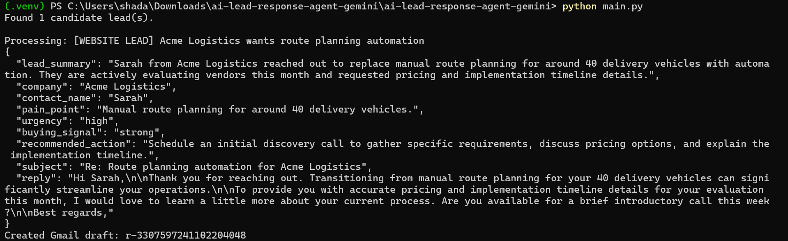
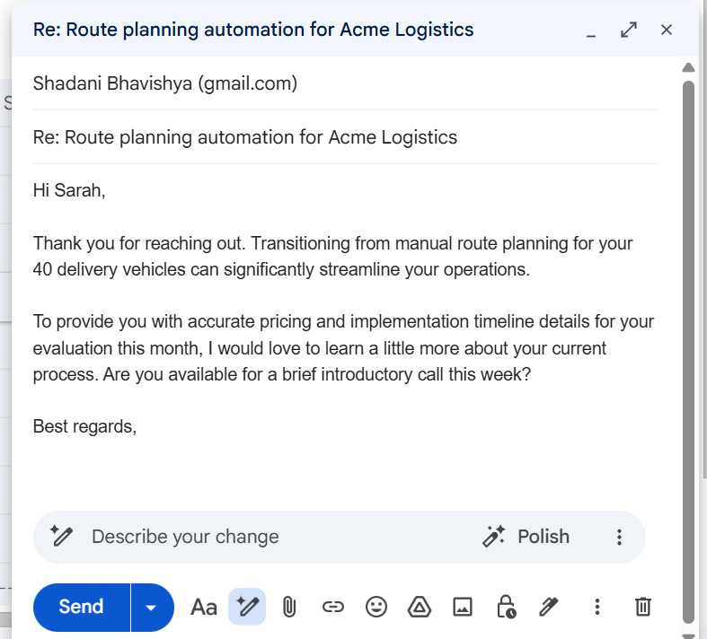
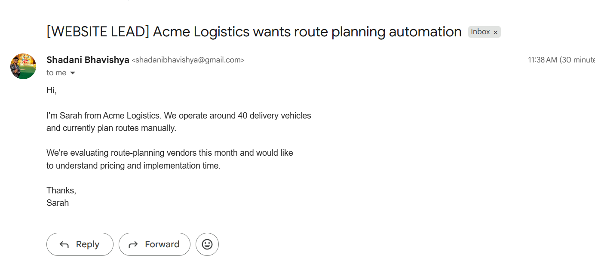
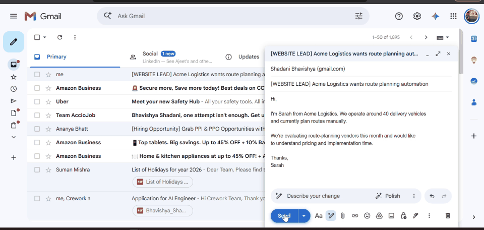

# AI Lead Response Agent — Gemini Flash

A code-first AI workflow for a small or mid-sized service/product business:

**Inbound lead email → Gemini Flash → structured qualification + personalized reply → Gmail draft**

The workflow intentionally stops at a Gmail draft. A human reviews and sends it.

---

## 1. The Problem

Inbound website leads often arrive as unstructured emails. A salesperson has to manually read each message, identify the company and pain point, judge urgency and buying intent, decide the next action, and write a personalized response.

This workflow automates the repetitive interpretation and drafting work while keeping a human responsible for the final send.

### Goal

> Turn an unstructured inbound website lead into structured sales qualification and a useful Gmail response draft in one workflow.

---

## 2. Capability Spotted

I explored Google's recent Gemini Flash model updates and used the **Gemini Interactions API with structured output** to build the workflow.

The successful execution path uses **Gemini 3.7 Flash**. During development, I initially tested Gemini 3.8 Flash, but a live request returned a temporary high-demand/server error. I switched the configurable model to Gemini 3.7 Flash without changing the surrounding workflow.

The model converts a free-form lead email into a predictable structure containing:

- Lead summary
- Company
- Contact name
- Pain point
- Urgency
- Buying signal
- Recommended next action
- Email subject
- Personalized reply

Official documentation:

- Google Gemini API documentation
- Gemini API pricing
- Gemini Interactions API
- Gemini structured output

---

## 3. Why This Pairing?

The business problem is an **unstructured information → structured action** problem.

For example, a lead may say:

> “We're evaluating route-planning vendors this month and would like to understand pricing and implementation time.”

The agent interprets the natural-language request and turns it into actionable information:

```text
Unstructured lead email
        ↓
Gemini Flash
        ↓
Structured qualification
        ↓
Personalized response
        ↓
Gmail draft
        ↓
Human review
```

This avoids building a new frontend or SaaS application just to prove the workflow.

---

## 4. Workflow Architecture

```text
                         ┌─────────────────────┐
                         │     Gmail Inbox     │
                         │                     │
                         │ [WEBSITE LEAD]      │
                         └──────────┬──────────┘
                                    │
                                    ▼
                         ┌─────────────────────┐
                         │     Python Agent    │
                         │                     │
                         │ Gmail API           │
                         └──────────┬──────────┘
                                    │
                                    ▼
                         ┌─────────────────────┐
                         │    Gemini Flash     │
                         │                     │
                         │ • Analyze lead      │
                         │ • Extract details   │
                         │ • Assess urgency    │
                         │ • Identify signal   │
                         │ • Recommend action  │
                         │ • Draft response    │
                         └──────────┬──────────┘
                                    │
                                    ▼
                         ┌─────────────────────┐
                         │   Structured JSON   │
                         └──────────┬──────────┘
                                    │
                                    ▼
                         ┌─────────────────────┐
                         │    Gmail Draft      │
                         │                     │
                         │ Human reviews       │
                         │ before sending      │
                         └─────────────────────┘
```

### Stack

- Python
- Gmail API
- Gemini API / Interactions API
- Pydantic for structured-output validation
- OAuth 2.0 for Gmail access

No frontend, hosted backend, n8n, Make, or visual workflow builder is required.

---

## 5. Example Input

The test lead used for the demo was:

```text
Subject:
[WEBSITE LEAD] Acme Logistics wants route planning automation

Hi,

I'm Sarah from Acme Logistics. We operate around 40 delivery vehicles
and currently plan routes manually.

We're evaluating route-planning vendors this month and would like
to understand pricing and implementation time.

Thanks,
Sarah
```

---

## 6. Example AI Output

The agent produced structured information such as:

```json
{
  "lead_summary": "Sarah from Acme Logistics reached out to replace manual route planning for around 40 delivery vehicles with automation. They are actively evaluating vendors this month and requested pricing and implementation timeline details.",
  "company": "Acme Logistics",
  "contact_name": "Sarah",
  "pain_point": "Manual route planning for around 40 delivery vehicles.",
  "urgency": "high",
  "buying_signal": "strong",
  "recommended_action": "Schedule an initial discovery call to gather specific requirements, discuss pricing options, and explain the implementation timeline.",
  "subject": "Re: Route planning automation for Acme Logistics"
}
```

The prompt tells the model to use only facts explicitly present in the lead. Missing information should be represented as `Unknown` rather than guessed.

---

# 7. Demo Evidence

The following screenshots show the complete working flow.

## 7.1 AI Analysis + Successful Execution

The terminal shows the lead being processed by Gemini and the Gmail draft being created successfully.



**Result:** `Created Gmail draft: r-3307597241102204048`

---

## 7.2 Generated Gmail Draft

The AI-generated response appears as a Gmail draft and is intentionally **not sent automatically**.



The human reviewer can edit the response and decide whether to send it.

---

## 7.3 Original Website Lead

This is the inbound lead that triggered the workflow.



---

# 8. How It Works

### Step 1 — Find Website Leads

The script searches Gmail for unread emails matching:

```text
is:unread subject:"[WEBSITE LEAD]"
```

This keeps the first version intentionally narrow and easy to test.

### Step 2 — Read the Lead

The Gmail API retrieves the email subject, sender and body.

### Step 3 — Analyze the Lead

Gemini receives the lead and is instructed to:

- Extract factual information
- Identify the primary pain point
- Assess urgency
- Identify buying signals
- Recommend a sensible next action
- Generate a concise personalized response

### Step 4 — Validate Structured Output

The response is generated using a defined JSON schema and validated with Pydantic.

### Step 5 — Create Gmail Draft

The generated subject and reply are converted into a Gmail draft.

The agent does **not** send the email.

---

# 9. Human-in-the-Loop Safety

A key design decision was:

> **Draft, don't send.**

AI can misunderstand a lead or generate an unsupported claim. Automatically sending a customer-facing email would create unnecessary risk.

The agent therefore handles:

```text
Understanding
     +
Qualification
     +
Drafting
```

The human handles:

```text
Final review
     +
Approval
     +
Sending
```

The prompt also instructs Gemini not to invent pricing, product capabilities, timelines, customer names, guarantees, integrations, or other facts that are not present in the lead.

---

# 10. Duplicate Protection

The script stores processed Gmail message IDs in:

```text
processed_ids.json
```

This prevents the same lead from generating multiple drafts every time the script is run.

For a production system, this state could be moved to a persistent datastore. For this assignment, a local JSON file is sufficient.

---

# 11. Project Structure

```text
ai-lead-response-agent-gemini/
│
├── main.py
├── requirements.txt
├── README.md
├── SUBMISSION.md
├── sample_lead.txt
├── .env.example
├── screenshots/
│   ├── 01-ai-analysis.png
│   ├── 02-gmail-draft.png
│   └── 03-incoming-lead.png
│
├── credentials.json        # local only 
├── token.json              # generated locally 
└── processed_ids.json      # generated locally
```

---

# 12. Setup

## Requirements

- Python 3.10+
- Gmail account
- Google Cloud project
- Gmail API enabled
- Gemini API key

## Install dependencies

```powershell
python -m venv .venv
.venv\Scripts\activate
pip install -r requirements.txt
```

If `.venv` is already active, do not recreate it.

## Configure Gemini

Create a `.env` file:

```env
GEMINI_API_KEY=YOUR_GEMINI_API_KEY
GEMINI_MODEL=gemini-3.7-flash
```


## Configure Gmail

Create a Google Cloud OAuth Desktop client, download `credentials.json`, and place it next to `main.py`.

The first execution opens Google's OAuth flow. After authorization, a local `token.json` is generated.

---

# 13. Running the Agent

Run:

```powershell
python main.py
```

The script:

1. Connects to Gmail.
2. Finds unread website leads.
3. Reads the lead.
4. Sends it to Gemini.
5. Validates the structured response.
6. Creates a Gmail draft.
7. Records the processed message ID.

Example successful output:

```text
Found 1 candidate lead(s).

Processing: [WEBSITE LEAD] Acme Logistics wants route planning automation

=== GEMINI LEAD ANALYSIS ===
{
  "company": "Acme Logistics",
  "contact_name": "Sarah",
  "pain_point": "Manual route planning for around 40 delivery vehicles.",
  "urgency": "high",
  "buying_signal": "strong"
}

Created Gmail draft: XXXXX
```

---

# 14. Model Fallback During Development

The model is configurable through:

```env
GEMINI_MODEL=gemini-3.7-flash
```

I initially tested Gemini 3.8 Flash. A live request temporarily returned a high-demand error, so I switched to Gemini 3.7 Flash.

This did not require changing the Gmail integration, parsing logic, structured schema, or draft creation logic.

This illustrates why the model layer should remain replaceable in an AI workflow.

---

# 15. Other Capability / Pain Pairings

| AI Capability | Business Pain | Possible Workflow |
|---|---|---|
| Gemini Flash reasoning | Slow lead qualification | Lead email → Gemini → Gmail draft |
| Multimodal understanding | Employees manually inspect long recordings | Video → AI → relevant moments + summary |
| Structured AI output | Manual extraction from documents | Document → AI → structured record |
| Tool-using agents | CRM updates forgotten after meetings | Meeting outcome → Agent → CRM |
| AI agents | Employees spend time assembling daily context | Gmail + Calendar → daily briefing |

I chose lead response automation because it has a short feedback loop and the final output can be demonstrated directly inside Gmail.

---

# 16. Future Improvements

If this prototype were moved toward production, I would consider:

- CRM integration
- Configurable lead scoring
- Company enrichment
- Approval workflow
- Response-time and conversion analytics
- Persistent state instead of local JSON
- API retries and monitoring
- Audit logs for generated responses

---

# 17. Final Result

The completed workflow takes an inbound lead such as:

```text
We have 40 vehicles and still plan routes manually.
We're evaluating vendors this month.
```

and produces:

```text
Company: Acme Logistics
Contact: Sarah
Pain Point: Manual route planning
Urgency: High
Buying Signal: Strong
Next Action: Schedule an initial discovery call
Output: Personalized Gmail draft
```

The salesperson then reviews the draft before sending it.

---

# 18. Repository / Submission Links


**Demo GIF:** See the Demo GIF Below In Summary Section.

---

## Summary

**Input:** Unread website lead in Gmail  
**AI:** Gemini Flash  
**Processing:** Lead qualification + structured extraction + personalized response generation  
**Output:** Gmail draft  
**Human control:** Required before sending  
**Implementation:** Python + Gmail API + Gemini API  
**Frontend:** None  
**Backend server:** None  
**Workflow automation platform:** None

## Demo GIF

The GIF below demonstrates the complete workflow:

**Inbound lead → Python agent → Gemini analysis → Gmail draft**



